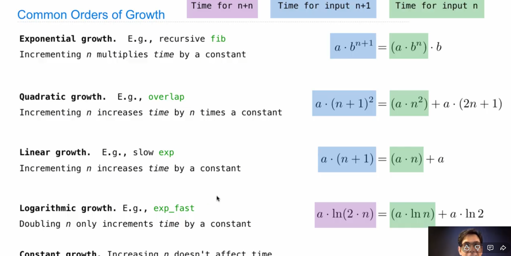
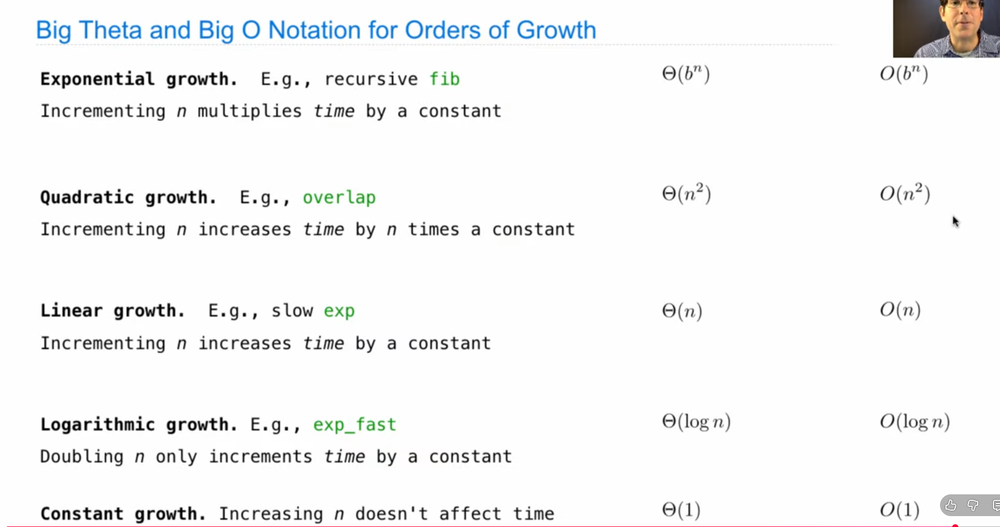

# measuring efficiency

## recursive call of fibonacci tree
```python
# count how many times do the function called in the calculation
def count(f):
    def counted(n):
        counted.call_count+=1
        return f(n)
    counted.call_count=0
    return counted
```
## memoization
```python
def memo(f):
    cache={}
    def memorized(n):
        if not n in cache:
            cache[n]=f(n)
        return cache[n]
    return memorized
# 优化调用函数的次数 不会重复调用
```
## exponentiation(幂运算)
```python
def exp(b,n):
    if n==0:
        return 1
    else:
        return b*exp(b,n-1)
def exp(b,n):
    if n==0:
        return 1
    elif n % 2== 0:
        return square(exp(b,n//2))
    else:
        return b*exp(b,n-1)
def square(x):
    return x*x
```
## Order of growth
### Quadratic time
```python
def overlap(a,b):
    count=0
    for i in a:
        for other in b:
            if i==other:
                count+=1
    return count
# 消耗的时间成二次函数形状
```

## order of growth notation

big theta ：f(n) ∈ Θ(g(n)) 意味着：当 n 足够大时，f(n) 既不会比 g(n) 小太多，也不会比 g(n) 大太多，它们同阶增长。
Big-O：上界（Upper bound）

f(n) ∈ O(g(n)) 意味着：当 n 足够大时，f(n) 不会超过 g(n) 的某个常数倍
*在计算机领域，这两个定义比较粗略*
# space
## the comsumption  of spaces 
- 主要来自values 和 frames
### active environmentd
-active : 当前正在计算且尚未被返回的调用，以及他们的parent frames
- inactive : 已经返回的，python会自动进行回收来释放内存
时间复杂度和空间复杂度
空间复杂度是是由树里面最长的那条链决定的 当一个frame有返回值的时候立即消失