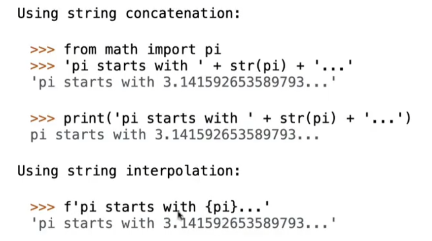
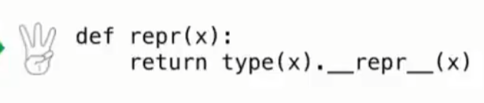
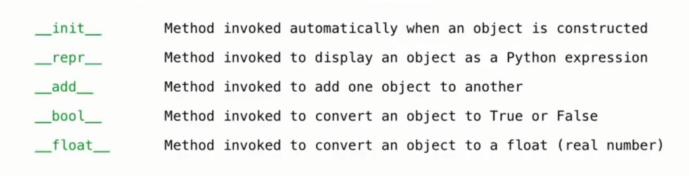

In python,all objects produce two string representations:
- The str is legible(可读的) to humans
- the repr is legible to python interpreter
因为python 的可读性很高，所以两个表达式的结果往往相同
repr(object) --> string
Return the canonical string representation of the object. 
The result of calling repr is what python prints
**Some objects do not have a simple python-readable string**
The result of string is what python shows using print function
```python
s='hello world'
>>>str(s) # str is immutable
'hello world'
>>>print(s)
hello world
>>>repr(s)
"'hello world'"
>>> eval(repr(s))
'hello world'
```
# F-strings
String interpolation involves evaluating a string literal that contains expressions
 如图所示 用上f''后花括号里面的表达式会被求值
 这种包含表达式的字符串文字 被称为字符串插值
The result of evaluating an f-string literal contains the str string of the value of each sub-expression.
# polymorphic function
A function that applies to many poly different forms morph of data  
# implementing repr and str
repr:
- An instance attribute called __repr__ is ignored! Only class attributes are found
- 只有这样才可以成功调用
str:
- An instance attribute called __str__ is also ignored
- if no __str__ attribute is found,use repr string.
# interface 
**Message passing** : objects interact by looking up attributes on each other
---
The attribute look-up rules allow different data types to respond to the same message
the same message : 相同的属性名
different data types：类，对象等等
```python
class Dog:
    def speak(self):
        return "woof"

class Cat:
    def speak(self):
        return "meow"

Dog().speak()  # "woof"
Cat().speak()  # "meow"
```
# special method names in Python
  总是以下划线开始和结束
看图
内置函数与内置语法 总是相关联的
## special method
__add__ & __radd__(第一个表达式写在右边)
```python
class Ratio:
    def __init__(self, n, d):
        self.numer = n
        self.denom = d

    def __repr__(self):
        return 'Ratio({0}, {1})'.format(self.numer, self.denom)

    def __str__(self):
        return '{0}/{1}'.format(self.numer, self.denom)

    def __add__(self, other):
        if isinstance(other, int):
            n = self.numer + self.denom * other
            d = self.denom
        elif isinstance(other, Ratio):
            n = self.numer * other.denom + self.denom * other.numer
            d = self.denom * other.denom
        elif isinstance(other, float):
            return float(self) + other # 类型强制转换
        g = gcd(n, d)
        return Ratio(n // g, d // g)

    __radd__ = __add__

    def __float__(self):
        return self.numer / self.denom


def gcd(n, d):
    while n != d:
        n, d = min(n, d), abs(n - d)
    return n

以上检测参数的类型 叫类型分派
```