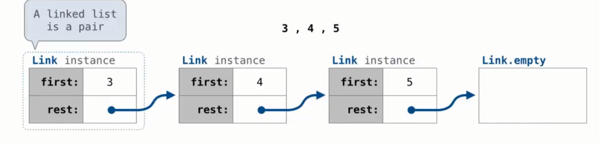

Linked list structure
- A linkef list is either empty or  a first value and the rest of the linked list
- 
```python
# how to build a linked list
Class Link:
empty= () #并不是唯一写法
    def __init__(self,first,rest=empty)
        assert rest is Link.empty or isinstance(rest,link)
        self.first=first
        self.rest=rest
Link(3,Link(4,Link(5,Link.empty )))
```
# Linked list processing
```python
# use recursive call
def odd(x):
    return x%2==1
def square(x):
    return x**2

def range_link(start,end):
    if start>=end:
        return Link.empty
    else:
        return Link(start,range_link(start+1,end))

def filter_link(f,s):
    if s is Link.empty:
        return s
    else:
        return Link(s.first,filter_link(f,s.rest)) if f(s.first) else return filter_link(f,s.rest) 
def map_link(f,s):
    if s is link.empty :
        return s
    else:
        return Link(f(s.first),map_link(f,s.rest))
```
# linked list mutation example
```python
def add(s,v):
    """Add v to an ordered list with no repeats, returning modified s"""
    if s.first > v :
        s.first, s.rest = v,s
    elif s.first<v and empty(s.rest):
        s.rest = Link(v)
    elif s.first < v :
        add(s.rest,v)
    return s
    
```
# Tree class
```python
# pruning Trees
